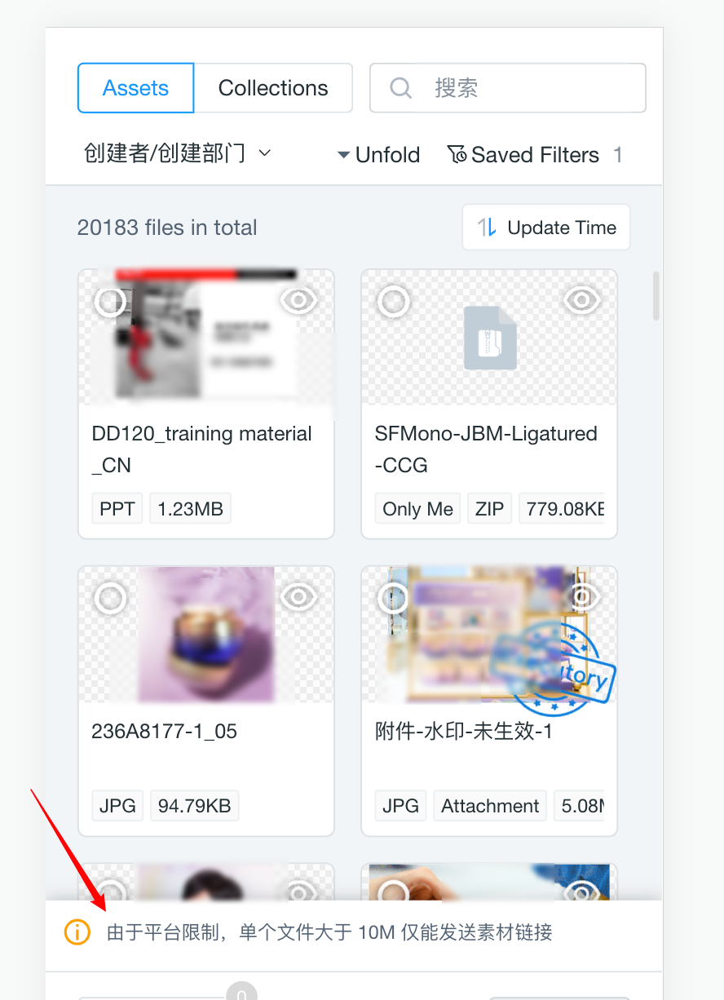
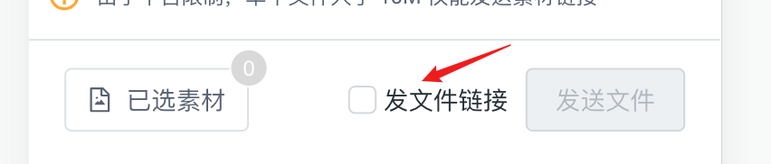

## 新增底部提示栏



### 数据结构

```typescript
interface SelectorUI {
  '#alert'?: {
    message: string; // 提示文案
  };
}

interface SelectorUICmd {
  type: 'tezign-selector-ui';
  data: SelectorUI;
}
```

### 例子

```javascript
iframe.contentWindow?.postMessage(
  {
    type: 'tezign-selector-ui',
    data: { '#alert': { message: '这是底部提示信息' } },
  },
  '*',
);
```

## 新增底部操作组件



### 数据结构

组件为完全受控组件，目前提供的组件类型有

```typescript
enum ECompType {
  Checkbox = 'checkbox',
}

interface IMetaCompCheckbox {
  type: ECompType.Checkbox;
  props: {
    id: string; // 用于在响应事件的时候回传识别
    disabled?: boolean;
    checked: boolean;
    text: string;
  };
}

type IMetaComp = IMetaCompCheckbox;

interface SelectorUI {
  '#action'?: IMetaComp[];
}

// ---- 组件事件
interface ComponentEvent {
  type: 'tezign-selector-comp-event';
  data: {
    type: ECompType;
    id: string;
    value: unknown; // 根据组件类型而定
  };
}
```

### 例子

```javascript
// 配置checkbox到底部操作栏
iframe.contentWindow?.postMessage(
  {
    type: 'tezign-selector-ui',
    data: {
      '#action': [
        {
          type: ECompType.Checkbox,
          props: {
            checked: false,
            id: 'checkbox_1',
            text: '发文件链接',
          },
        },
      ],
    },
  },
  '*',
);

// ---- 响应组件事件
window.addEventListener(
  'message',
  (event) => {
    if (event?.data?.type === 'tezign-selector-comp-event') {
      const { type, id, value } = event?.data?.data || {};
      if (type === ECompType.Checkbox && id === 'checkbox_1') {
        // ... do something
        // for example, use 'tezign-selector-ui' command to toggle checked state
        console.log(value);
      }
      return;
    }
  },
  false,
);
```

## 确认按钮文案可配置

### 数据结构

```typescript
interface SelectorUI {
  confirmBtn?: {
    text: string; // 确认按钮文案
  };
}

interface SelectorUICmd {
  type: 'tezign-selector-ui';
  data: SelectorUI;
}
```

### 例子

```typescript
iframe.contentWindow?.postMessage(
  {
    type: 'tezign-selector-ui',
    data: { confirmBtn: { text: '确认按钮文案' } },
  },
  '*',
);
```

## 新增数据保护

新增数据保护，点击确定后，会进行鉴权，权限不足会有 modal 提示。过滤点击确认之后返回的数据字段，比如查看权限不会有下载链接。可以申请的权限有：

- 查看（默认值）
- 下载

### 数据结构

```typescript
enum EAuthCode {
  VIEW = 'searchOriginalAuth',
  DOWNLOAD = 'downloadOriginalAuth',
}

interface ApplyAuthCmd {
  type: 'tezign-selector-auth';
  data: { auth: EAuthCode };
}
```

### 例子

```javascript
iframe.contentWindow?.postMessage(
  {
    type: 'tezign-selector-auth',
    data: { auth: EAuthCode.DOWNLOAD },
  },
  '*',
);
```

## 新增“选择更新”事件

触发时机是用户选择素材更新的时候。

### 数据结构

```typescript
interface SelectionChangeEvent {
  type: 'tezign-selector-selection-change';
  data: ConfirmData; // 同tezgin-selector-confirm-btn的数据结构（只看权限）
}
```

## 新增素材大小限制

config 新增 sizeLimit 可选字段，控制选择的素材大小，单位是 byte。

### 例子

```javascript
iframe.contentWindow.postMessage(
  {
    type: 'tezign-material-selector',
    data: {
      config: [
        { id: 'image', limit: 5 },
        { id: 'audio', limit: 9, sizeLimit: 10 * Math.pow(1024, 2) },
      ],
      filterCode: 'open-component-search-003',
      formatLimit: 5,
      sizeLimit: 10 * Math.pow(1024, 2), // 只能选择<=10MB素材
    },
  },
  '*',
);
```
