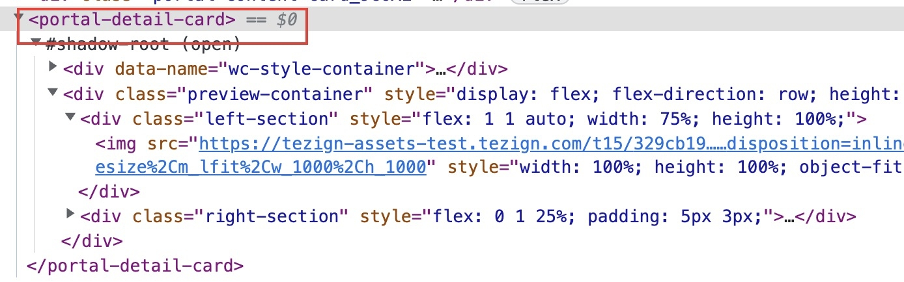

Component plugin 主要负责在 Slot 中渲染 UI。和它的名字不同，其实对外暴露的并不是一个组件，而是一个渲染组件的 render 函数，并接受 rootElement 和 props 作为入参。
由于前端框架众多，所以采用了 render 函数的方式， 可以与 DAM 互不依赖。

Component plugin 的组件会被作为一个 [Web Component](https://developer.mozilla.org/en-US/docs/Web/API/Web_components) 渲染到 Slot 中，并且支持开启 [Shadow DOM](https://developer.mozilla.org/en-US/docs/Web/API/Web_components/Using_shadow_DOM)。
这样做的好处是，可以避免 CSS 样式污染，也可以避免不同插件之间的 DOM 事件冲突。但因此要把插件的样式以 CSS String 来在样式注入，如果你的插件里导出了 CSS String，DAM 会自动进行样式注入。



## 数据类型

```typescript
interface ComponentPlugin<T> {
  render: (container: HTMLElement | ShadowRoot, props: T) => void;
  cssString: string | undefined;
  useShadowDom: boolean | undefined;
}
```

## CSS String 导出

插件的样式可以通过 CSS String 导出，DAM 注入样式。目前对 Vite，我们给出了以下几种解决方案

### Inline CSS

Vite 支持 inline CSS 内容

```typescript
// highlight-next-line
import cssString from './app.module.scss?inline';

function render(...args) {
  // ...
}

const useShadowDom = false;

export { render, cssString, useShadowDom };
```

缺点是需要手动管理样式的导出，容易出现遗漏，不利于维护。

### Vite 插件

我们为这个场景准备了一个 Vite 插件[@tezignlab/vite-plugin-dam-plugin](https://www.npmjs.com/package/@tezignlab/vite-plugin-dam-plugin)，不再需要手动管理样式的导出，也不会遗漏样式。

```typescript title="vite.config.ts"
import { defineConfig } from 'vite';
// highlight-next-line
import damPlugin from '@tezignlab/vite-plugin-dam-plugin';

// https://vitejs.dev/config/
export default defineConfig({
  // highlight-next-line
  plugins: [damPlugin()],
});
```

然后只要在插件的入口文件里这样使用即可

```typescript title="plugin.tsx"
// highlight-next-line
import cssString from 'virtual:dam-plugin-css-string';

function render(...args) {
  // ...
}

const useShadowDom = true;

export { cssString, render, useShadowDom };
```

如果你使用我们的脚手架来[初始化项目](../getting-started/index.md#新建项目)，这个插件已经默认安装了。
