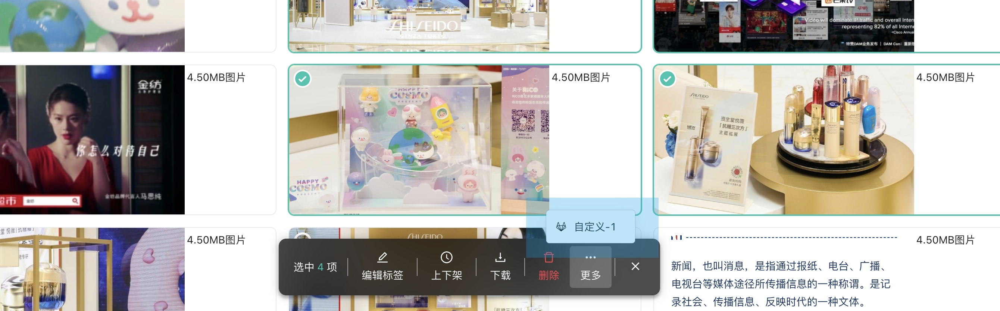

Portal 详情页的批量操作"更多"下拉选项



## 插件数据类型

```typescript
interface MenuItem {
  /** key */
  key?: string | number;
  /** 标题 */
  title?: string;
  /**
   * 仅接受SVG。
   */
  icon?: string;
  /** Button类型  */
  type?:
    | 'link'
    | 'text'
    | 'ghost'
    | 'default'
    | 'primary'
    | 'dashed'
    | 'danger';
  /** children */
  children?: (IItem | undefined)[];
  onClick?: (data: any) => void;
  /** container 类名 */
  className?: string;
  /** 前分割线 */
  preDivider?: boolean;
  /** 后分割线 */
  postDivider?: boolean;
  style?: React.CSSProperties;
  /** 按钮禁用 */
  disable?: boolean;
  /** 按钮tooltip文案 */
  tooltip?: string | (() => string | undefined);
}

interface FunctionPlugin_PortalDetailOperationMore<PluginApp> {
  (app: PluginApp): MenuItem[];
}
```

## 例子

TODO
