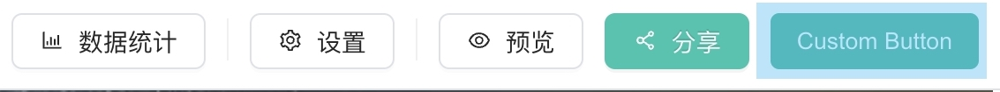

Portal 详情页的顶部自定义按钮'右侧'插入



## 数据结构

```typescript
interface ComponentPlugin_PortalHeaderActionRight<T> {
  render: (container: HTMLElement | ShadowRoot, props: T) => void;
  cssString: string | undefined;
  useShadowDom: boolean | undefined;
}
```

## 例子

TODO
