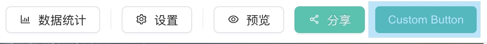

import Tabs from '@theme/Tabs';
import TabItem from '@theme/TabItem';

Portal 详情页的顶部'右侧'自定义按钮



## 插件类型

[Component](../plugin-types/component-plugin)

## 数据结构

```typescript
interface ComponentPlugin_PortalHeaderActionRight<T> {
  render: (container: HTMLElement | ShadowRoot, props: T) => void;
  cssString: string | undefined;
  useShadowDom: boolean | undefined;
}
```

## 例子

<Tabs>
  <TabItem label="plugin.ts" value="plugin.ts" default>

```tsx
import { render } from './App';

const cssString = '';
const useShadowDom = true;

export { cssString, render, useShadowDom };
```

  </TabItem>

  <TabItem label="App.tsx" value="app.tsx" default>

```tsx
import React from 'react';
import ReactDOM from 'react-dom/client';

function App(props: any) {
  return (
    <button
      onClick={() => {
        console.log('clicked');
      }}
    >
      Button
    </button>
  );
}

const weakMap = new WeakMap<HTMLElement | ShadowRoot, ReactDOM.Root>();

function render(root: HTMLElement | ShadowRoot, props?: any) {
  console.log('...', arguments);

  let reactDOMRoot = weakMap.get(root);
  if (!reactDOMRoot) {
    reactDOMRoot = ReactDOM.createRoot(root);
    weakMap.set(root, reactDOMRoot);
  }

  reactDOMRoot.render(
    <React.StrictMode>
      <App {...props} />
    </React.StrictMode>,
  );
}

export { render };
export default App;
```

  </TabItem>
</Tabs>
