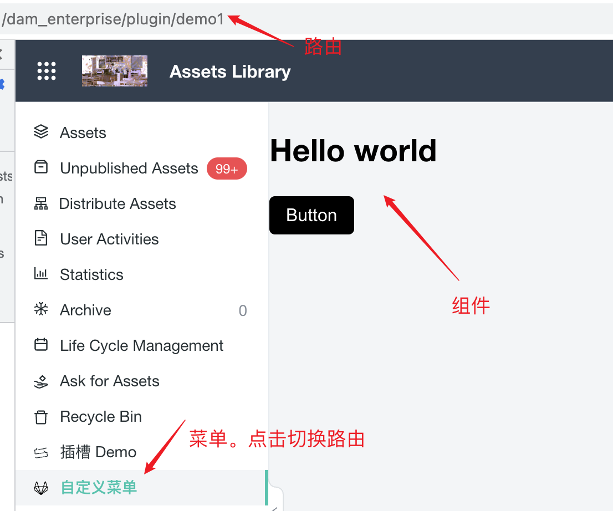

# DAM Plugin Basic

在这个例子里，你将会了解到如何使用 DAM 插件来实现以下功能

- [添加插件路由](./src/entry_plugin.ts)
- [添加素材库左侧菜单](./src/menu_plugin.ts)
- [在 DAM 的插槽里渲染你的组件](./src/component_plugin.ts)

透过这个例子，你会了解到如何实现

- Function Plugin
- Component Plugin

例子的运行效果


## 安装

```shell
npm install
```

## 运行组件

```shell
npm run dev
```

在这个模式下开发你的插件。

## 打包插件

```shell
npm run build
```

然后你会在`dist`目录下看到三个文件

```
component_plugin.[hash].js
entry_plugin.[hash].js
menu_plugin.[hash].js
```
